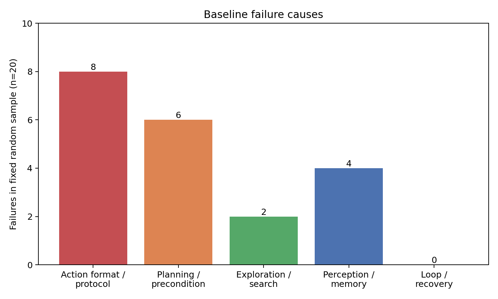
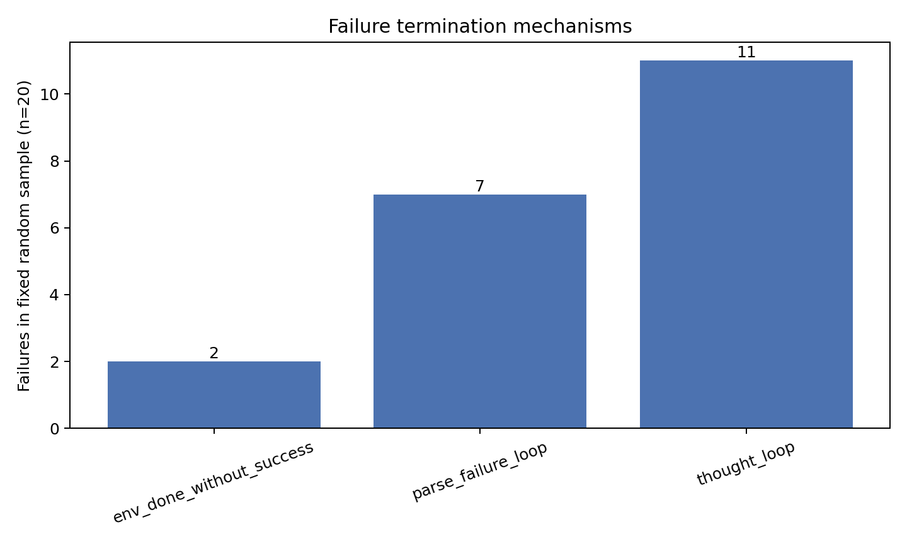
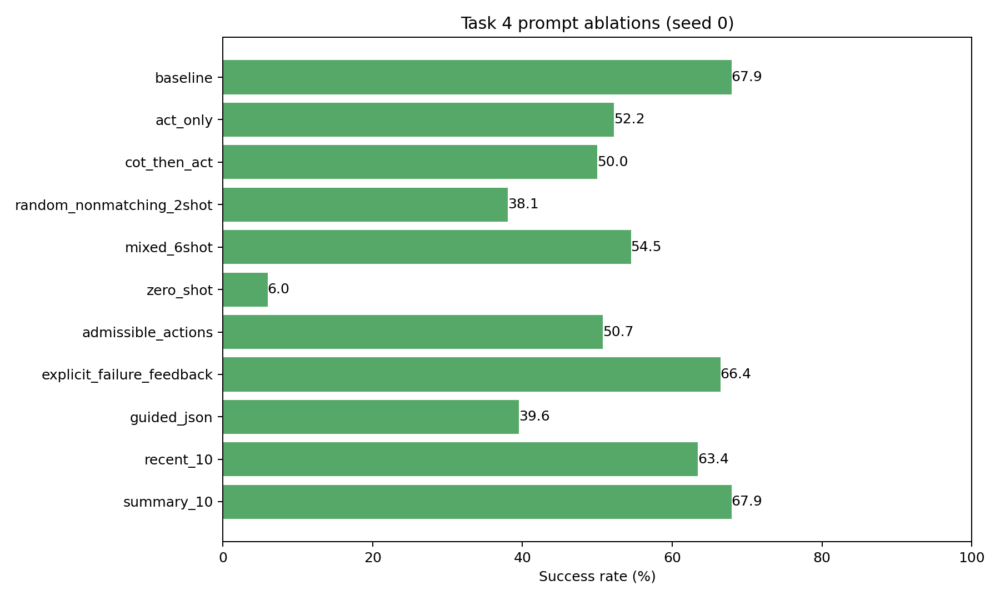

# 任务四：Prompt 优化与消融分析

## 1. 研究问题与实验协议

本任务研究 Qwen2.5-7B-Instruct 在 ALFWorld 文本环境中的 prompt 敏感性。任务三的 ReAct 条件作为公共对照：官方 `alfworld_3prompts.json`、任务类型匹配 2-shot、`/v1/completions`、不注入 `admissible_commands`、自由文本、原始失败反馈、完整历史、unseen 134 局、`temperature=0`、`max_tokens=100`、最多 50 次 `env.step`、8 workers。

题目列出的方向 1 至 6 全部实现，共 11 个唯一配置；每个变体只改变一个因素。方向 7 Reflexion 未纳入，因为失败后重试会改变单次尝试协议，不能与本表直接比较。任务协议专项提示也未作为实验配置，避免用额外自拟方向替代题目要求。

所有 seed 0 运行使用同一份 134-game manifest，集合 SHA-256 为：

```text
9d7b36e410ca9fe4dc1fc5e20cb7750f823e271af775b4f650799e9da3740793
```

`env_steps` 只计算真实环境动作；`agent_turns` 是决策模型调用；`llm_calls` 还包括 CoT 初始规划与轨迹摘要调用。非法动作率为 `invalid_actions / action_steps`，parse failure 不混入分子或分母。token 来自 OpenAI-compatible API 的 usage 字段。

## 2. 先做错误分析

从任务三 42 条失败中，先按 `game_id` 排序，再用 `random.Random(42).sample(..., 20)` 无放回抽样。正式样本、逐条证据和修复建议见 `failure_sample_seed42.csv`；元数据保存算法、seed、20 个 failure ID 及源文件 SHA-256。此前的 `failure_analysis_20_en.csv` 仅保留为代表性分析，不作为本次随机样本。

| 主因 | 数量 | 占比 |
| --- | ---: | ---: |
| 动作格式/任务协议 | 8 | 40% |
| 规划/前置条件 | 6 | 30% |
| 感知/记忆 | 4 | 20% |
| 探索/找物 | 2 | 10% |
| 死循环/恢复 | 0 | 0% |



20 条轨迹的终止机制为 thought loop 11 条、parse-failure loop 7 条、环境结束或步数耗尽 2 条。终止机制不是根因：18 条以循环结束，但逐步回看后，循环通常由更早的任务协议、前置条件或记忆错误触发。因此没有把“最后出现循环”机械地标成主因。



最集中的错误是 `look_at_obj_in_light`：模型常生成 `examine OBJ with desklamp`，而本地完成协议通常是先 `take` 目标，再到灯处执行 `use desklamp`。two-object 还常见未放下第一件物体便拿第二件，或把同一 ID 重复计数。该分布支持优先考察输出协议、推理方式、失败反馈和记忆，而非只改采样参数。

## 3. 消融定义与事前假设

| 方向 | 对照水平 | 事前假设 |
| --- | --- | --- |
| 推理策略 | ReAct / Act-only / CoT-then-Act | ReAct 最好；Act-only 最省 token；一次性 CoT 介于二者之间。 |
| Few-shot | 匹配 2-shot / 随机非匹配 2-shot / mixed 6-shot / 0-shot | 匹配 2-shot 优于随机与 0-shot；6-shot 不一定单调提高。 |
| 动作空间 | 不注入 / 当前完整合法动作列表 | 注入会显著降低非法动作并提升成功率，但增加 token 且泄漏动作空间。 |
| 失败反馈 | 原始反馈 / 显式恢复提示 | 显式提示减少重复动作和循环，对规划错误帮助有限。 |
| 输出结构 | 自由文本 / guided JSON | JSON 语法错误接近零，语义非法动作未必下降，约束可能损害推理。 |
| 历史策略 | 完整 / 最近 10 turns / 摘要+最近 10 turns | 完整历史最好；最近窗口最省；摘要恢复部分表现但可能失真。 |

CoT-then-Act 没有冒充“仓库已有的等价 prompt”。官方文件只有 `react_*` 和 `act_*`，没有唯一公认的 `cot_*` 轨迹。本实验将它严格定义为：使用与 Act-only 相同的两条 `act_*` 示例，开局单独生成一次不虚构物体 ID 的高层计划，把计划写入上下文，此后只允许动作。于是相对 Act-only 的唯一新增因素是“一次初始规划及其计划文本”；相对 ReAct 则同时不同于示例族、推理时机和能否根据 observation 更新推理，不能把差值全归因于 thought token 数量。

### 3.1 mixed 6-shot 实现与 grammar 审计

`mixed_6shot` 对所有目标任务固定使用 `react_put_1`、`react_clean_1`、`react_heat_1`、`react_cool_1`、`react_examine_1`、`react_puttwo_1`，即六类任务各一条。它不是在 baseline 的两条匹配示例上追加四条：对任一目标任务，它只有一条同类示例和五条异类示例，并移除了 baseline 使用的同类 `_0` 示例。同类示例的位置还随任务类型固定在第 1 至第 6 位，因此该实验臂检验的是题目指定的“数量与混合匹配方式”联合条件，不能把差值解释成纯粹的 shot 数量效应。

逐条审计六条示例的 73 个 action 后，所有 action 都能被当前解析器识别，归一化后也都匹配本地 `alfred.twl2` 的命令形式。官方示例中的 6 次 `put OBJECT in/on RECEPTACLE` 不是本地普通放置命令的字面形式；评测器在所有实验臂中统一将其转换为 `move OBJECT to RECEPTACLE` 后再送入环境。这是 baseline 与变体共享的协议适配，不是 mixed6 专属修补。六条示例都完成了各自目标，没有包含失败动作。唯一发现的内容瑕疵是 `react_puttwo_1` 在放下第一部手机后仍说“starting with coffeetable 1”，下一条 action 实际正确地去 `diningtable 1`；它不造成 grammar 错误，而且同一示例也用于 two-object baseline，故未在正式结果之后追改 prompt。

配置和正式 `run_metadata.json` 的对照表明，匹配 2-shot、随机非匹配 2-shot、mixed 6-shot、0-shot 除 `fewshot_strategy` 外设置完全相同；共同使用同一模型、manifest、推理方式、历史、解码参数和步数限制。四组均无上下文预算截断 episode，排除了 mixed6 因 24,000 字符上限被意外截断的解释。

## 4. seed 0 主实验



| 配置 | 成功 | 成功率 | 相对基线 | 非法动作率 | Parse rate | 重复动作率 | 平均总 token |
| --- | ---: | ---: | ---: | ---: | ---: | ---: | ---: |
| baseline | 91/134 | 67.9% | 0.0 pp | 30.5% | 6.7% | 21.0% | 51,440 |
| Act-only | 70/134 | 52.2% | -15.7 pp | 12.7% | 29.8% | 5.4% | 17,996 |
| CoT-then-Act | 67/134 | 50.0% | -17.9 pp | 25.0% | 24.2% | 14.4% | 30,037 |
| 随机非匹配 2-shot | 51/134 | 38.1% | -29.9 pp | 31.1% | 10.6% | 20.9% | 75,566 |
| mixed 6-shot | 73/134 | 54.5% | -13.4 pp | 15.7% | 15.8% | 4.9% | 105,556 |
| 0-shot | 8/134 | 6.0% | -61.9 pp | 58.1% | 35.1% | 28.5% | 16,196 |
| 注入合法动作 | 68/134 | 50.7% | -17.2 pp | 24.9% | 0.1% | 32.3% | 97,596 |
| 显式失败反馈 | 89/134 | 66.4% | -1.5 pp | 39.0% | 4.3% | 31.1% | 66,562 |
| guided JSON | 53/134 | 39.6% | -28.4 pp | 9.0% | 0.8% | 1.1% | 81,315 |
| 最近 10 turns | 85/134 | 63.4% | -4.5 pp | 20.9% | 9.5% | 9.8% | 42,819 |
| 摘要+最近 10 | 91/134 | 67.9% | 0.0 pp | 19.3% | 10.1% | 9.0% | 40,538 |

分任务成功数如下，列分母依次为 24、31、23、21、18、17。

| 配置 | place | clean | heat | cool | look-at | two-object |
| --- | ---: | ---: | ---: | ---: | ---: | ---: |
| baseline | 22 | 21 | 20 | 18 | 2 | 8 |
| Act-only | 23 | 16 | 5 | 17 | 1 | 8 |
| CoT-then-Act | 19 | 18 | 8 | 14 | 1 | 7 |
| 随机非匹配 2-shot | 17 | 9 | 13 | 7 | 3 | 2 |
| mixed 6-shot | 20 | 17 | 17 | 11 | 0 | 8 |
| 0-shot | 3 | 5 | 0 | 0 | 0 | 0 |
| 注入合法动作 | 14 | 18 | 12 | 18 | 6 | 0 |
| 显式失败反馈 | 21 | 21 | 21 | 16 | 1 | 9 |
| guided JSON | 5 | 12 | 12 | 14 | 4 | 6 |
| 最近 10 turns | 20 | 18 | 20 | 17 | 3 | 7 |
| 摘要+最近 10 | 21 | 21 | 20 | 18 | 3 | 8 |

任务四 baseline 与任务三正式结果使用相同设置，但本次独立重跑为 91/134，任务三为 92/134。即使 `temperature=0`，不同并发 batch 的数值路径仍可能造成个别轨迹变化，所以主表统一使用本次固定 manifest 的 seed 0 baseline。

## 5. 假设检验与解释

### 5.1 推理策略

ReAct 比 Act-only 高 15.7 pp，比 CoT-then-Act 高 17.9 pp，支持“反馈后动态推理有价值”；Act-only token 仅为基线的 35.0%，支持成本假设。CoT-then-Act 反而比 Act-only 低 2.2 pp，推翻“介于二者之间”：初始计划看不到后续容器内容，不能显式改写，还可能形成错误锚定。Act-only 和 CoT 的高 parse rate 主要来自模型违反 only-action 协议，说明自然语言指令只能诱导，评测器仍需检测 mode violation。

### 5.2 Few-shot 数量与匹配

| 条件 | 实际示例构成 | 成功率 | 相对 baseline |
| --- | --- | ---: | ---: |
| 0-shot | 无示例 | 6.0% | -61.9 pp |
| 随机非匹配 2-shot | 2 条异类 | 38.1% | -29.9 pp |
| mixed 6-shot | 1 条同类 + 5 条异类 | 54.5% | -13.4 pp |
| 匹配 2-shot | 2 条同类 | 67.9% | 0.0 pp |

按题目给定的四个条件，成功率随“0 条到随机 2 条到 mixed 6 条”增加，但 6-shot 仍低于匹配 2-shot，因此**示例数量并不单调提升性能**。事前假设“匹配 2-shot 优于随机与 0-shot，6-shot 不一定单调提高”得到支持；与“mixed6 应显著优于 baseline”的额外预期相差 -13.4 pp。配对到同一批 game 后，mixed6 使 9 局由失败转成功，却使 27 局由成功转失败，净少 18 局，下降不是总成功数四舍五入造成的偶然表象。

当前设计**不能严格回答在哪里饱和**。原因是 0、2、6 三个数量点同时改变了相关性：2-shot 还分为全匹配和全不匹配，6-shot 则是 1 匹配 + 5 不匹配，没有匹配 1/3/6-shot 这条只改变数量的序列。现有证据只能说“所采样条件中匹配 2-shot 最好”，不能事后声称“2-shot 已饱和”。若研究目标必须定位饱和点，需要另设固定匹配规则下的 1/2/3-shot 等数量点；这超出题目明确要求的四臂，本次没有追加。

mixed6 下降有三个与轨迹一致的原因。第一，它损失了一条同类示例，五条异类轨迹会竞争任务协议与注意力，且固定顺序带来位置/近因差异。第二，它把平均总 token 推至 105,556，约为 baseline 的 2.05 倍，但更多上下文没有提供第二条目标任务轨迹。第三，mixed6 虽把非法动作率从 30.5% 降到 15.7%、重复动作率从 21.0% 降到 4.9%，parse rate 却从 6.7% 升到 15.8%；这说明它改善了局部动作模仿，却更容易在 ReAct 的 thought/action 协议切换上失败。0-shot 在 heat、cool、look-at、two-object 上几乎完全失去本地任务协议。随机映射由 seed 42 固定，并在 YAML 和每次 summary 的 `selected_prompt_keys` 中留档。

轨迹转移进一步支持“恢复协议变差”而非 grammar 错误：一次非法动作之后，下一 turn 立即成为 parse failure 的比例由 baseline 的 20/683（2.9%）升至 mixed6 的 38/282（13.5%）；mixed6 的 parse failure 中仅原样输出 `ouch` 就有 375 次。配对 exact McNemar 检验基于 9/27 个不一致对得到 `p=0.00393`，在这批固定 game 上下降具有明确证据。随后补跑 seed 1、2，mixed6 为 72/134、74/134，三种子均值 54.48% ± 0.75 pp，仍稳定低于 baseline 的 67.41% ± 0.43 pp。

### 5.3 Admissible actions

非法动作率从 30.5% 降至 24.9%，parse rate 几乎归零，但成功率降至 50.7%，平均 token 增至 97,596。因而“会降低部分格式错误”成立，“大幅降非法且提升成功率”不成立。完整列表让模型更少输出不可解析文本，却可能在大量候选中反复选择局部合法但不推进目标的动作；two-object 甚至为 0/17。该设置还暴露当前位置可执行动作和对象关系，属于更强信息条件，不能与纯 ReAct 数字无标注混用。

### 5.4 显式失败反馈

成功率 66.4%，接近基线；parse-failure loop 从 23 局降至 11 局，但环境耗尽从 7 局增至 18 局，重复动作率由 21.0% 升至 31.1%，非法动作率也升至 39.0%。假设仅部分成立：提示改变了终止形式，却没有可靠恢复策略，部分轨迹只是从解析循环转成更长的无效探索。对首次规划、物体身份和任务语义错误帮助有限。

### 5.5 Guided JSON

parse rate 从 6.7% 降至 0.8%，非法动作率降至 9.0%，但成功率只有 39.6%，79 局以 thought loop 结束。请求 schema 声明两字段必须存在且恰一非空；由于兼容版 xgrammar 不完整执行 `minLength` 等字符串语义约束，评测器还会二次强制互斥非空，不合格输出计 parse failure。正式轨迹未出现双空。34 次解析失败中，16 次为长 thought 撞到 100-token 上限导致 JSON 未闭合，18 次是 JSON 合法但 action 内容不属于本地可解析协议。结论支持“语法约束有效但不保证策略质量”：schema 能约束外壳，不能约束何时行动、动作语义与任务完成协议，而且结构化长 thought 增加了解码成本。

### 5.6 轨迹压缩

最近 10 turns 为 63.4%，比基线低 4.5 pp，平均 token 降 16.8%；摘要+最近 10 与基线同为 67.9%，token 低 21.2%，但平均模型调用由 24.75 增至 33.80。窗口损失和摘要恢复假设成立，“完整历史最好”被 seed 0 结果推翻。摘要的 token 仍计入总成本；调用更多但每次决策上下文更短，所以总 token 反而下降。摘要会遗漏或误写事实，不能只看 seed 0 平局断言其普遍优于 baseline。

## 6. 已完成三种子结果

选择规则在运行前固定为：成功率降序，再按非法动作率、parse rate、平均总 token、配置名升序打破平局。seed 0 中 `summary_10` 与 baseline 同为 91/134，但前三项更优，因此选为最好；`zero_shot` 最差。题目要求的最好/最差三种子已完成，之后又补跑了 baseline、推理策略和 few-shot 方向的 seed 1、2；其余 `admissible_actions`、`explicit_failure_feedback`、`guided_json`、`recent_10` 保留 seed 0。完整表见 `multiseed_all_configs.csv`。

| 配置 | seed 0/1/2 成功数 | 成功率均值 ± 样本标准差 | 非法动作率 | Parse rate | 平均总 token |
| --- | --- | ---: | ---: | ---: | ---: |
| baseline | 91 / 90 / 90 | 67.41% ± 0.43 pp | 32.48% ± 2.16 pp | 7.05% ± 1.42 pp | 55,053 ± 4,202 |
| Act-only | 70 / 70 / 68 | 51.74% ± 0.86 pp | 12.44% ± 0.20 pp | 29.96% ± 0.22 pp | 18,194 ± 344 |
| CoT-then-Act | 67 / 64 / 66 | 49.00% ± 1.14 pp | 28.20% ± 3.54 pp | 23.99% ± 1.93 pp | 30,272 ± 616 |
| 随机非匹配 2-shot | 51 / 52 / 53 | 38.81% ± 0.75 pp | 30.75% ± 0.37 pp | 10.69% ± 0.58 pp | 76,640 ± 991 |
| mixed 6-shot | 73 / 72 / 74 | 54.48% ± 0.75 pp | 16.34% ± 0.85 pp | 15.05% ± 1.73 pp | 111,625 ± 5,412 |
| 0-shot | 8 / 8 / 9 | 6.22% ± 0.43 pp | 58.81% ± 0.74 pp | 33.88% ± 1.26 pp | 14,742 ± 1,325 |
| 摘要+最近 10 | 91 / 92 / 87 | 67.16% ± 1.97 pp | 19.08% ± 0.19 pp | 9.47% ± 0.90 pp | 42,311 ± 1,662 |

三种子后，baseline 与 `summary_10` 成功率基本持平，不能说摘要显著优于 baseline；但 `summary_10` 用更少 token 保住了相近表现。Act-only、CoT-then-Act、随机非匹配 2-shot、mixed 6-shot 和 0-shot 均稳定低于 baseline，其中 mixed6 的下降跨种子稳定，说明“更多示例”没有抵消“同类示例减少与异类协议干扰”。

## 7. 配对变化与能力边界

相对 baseline，`summary_10` 有 11 局“失败变成功”，也有 11 局“成功变失败”，净值为 0；`recent_10` 为 8/14；显式反馈为 7/9；guided JSON 为 14/52。只看总成功数会掩盖策略替换了哪些 episode，因此完整四格变化已按六类任务写入 `paired_success_changes.csv`。

11 个 seed 0 配置共同失败 9 局：6 局 look-at，另有 clean、cool、two-object 各 1 局。这些持久失败集中于“拿目标后用灯”的任务协议、精确物体身份、容器前置条件和双物体状态跟踪。

Prompt 较擅长解决输出外壳、示例协议、局部恢复措辞和短期记忆长度；它很难稳定补上未学会的状态机、跨长轨迹对象绑定、失败后的策略切换与基于环境成功信号的校验。某个提示若只把错误从 parse loop 移到 50 步耗尽，不能算能力提升。当多个单变量 prompt 在同一 episode 上持续失败，且错误涉及同一种可执行协议或状态转移时，应停止继续堆提示，转向用成功轨迹和纠错轨迹做 SFT，再用环境奖励或偏好优化训练恢复策略。

## 8. Completion 与 chat 的控制

官方 ReAct prompt 是一个连续 completion 文本，末尾以 `> `等待下一行：

```text
Interact with a household...
Here are two examples.
...
Here is the task.
Your task is to: ...
>
```

若把整段直接塞进 chat 的 user 消息，模型实际看到的是类似：

```text
<|im_start|>user
[整段 ReAct completion prompt]
<|im_end|>
<|im_start|>assistant
```

chat template 新增角色与 special token，且示例中的 `> action / observation` 不再处于原训练位置；若拆成多轮 messages，还会为每轮加入角色边界。因此这不是等价 API 替换。本实验统一使用 `/v1/completions`。若重构为 system/user/assistant 多轮，应把“prompt 表示方式”单列为消融变量，而不是与其他结果混比。

## 9. 开放问题

1. **与真实 GUI/工具调用相比缺什么？**
ALFWorld 缺少像素定位、动态界面、异步反馈、权限/网络故障和不可逆风险。它能迁移任务分解、状态跟踪和失败恢复能力，但对视觉 grounding、精确点击及真实工具鲁棒性的外推有限。

2. **成功率够吗？**
不够。可同时报告成功条件下环境步数、无效/重复动作率、首次发现目标的步数、已访问位置覆盖与重复率、相对最短路径 regret、token/调用成本，并把未成功但完成部分子目标的进度单独计分。

3. **何时停止调 prompt？**
当多种提示只改变错误表象、跨种子收益小于波动，或同一批 episode 持续因状态转移、对象绑定和恢复策略失败时，应停止。此时继续加规则会增加 token 和冲突，宜把失败转成训练数据并做 SFT/RL。

4. **如何用 1000 条轨迹提升模型？**
先按任务、成败和根因去重分层；从成功轨迹提炼短而正确的动作协议，从失败轨迹构造“错误前缀→正确下一步/恢复”样本做 SFT，再建立成败或步骤质量偏好对训练，最后留出 game 做闭环评测，避免泄漏。

## 10. 复现与交付

```bash
conda activate /root/autodl-tmp/envs/qwen-vllm-clean
cd /root/alfworld-agent
bash scripts/serve.sh

conda activate alfworld
cd /root/alfworld-agent
python -m pip install -r requirements-task4.txt
python -m unittest tests.test_task4
python scripts/run_task4.py --stage dry-run
python scripts/run_task4.py --stage smoke
python scripts/run_task4.py --stage primary
python scripts/run_task4.py --stage replicate
python scripts/analyze_task4.py
```

25 次正式运行均为 134 个唯一 game、六类齐全、同一 manifest、`errors=0`；`trajectories.jsonl`、`summary.json` 与分任务 CSV 已由聚合脚本逐项重算并通过一致性检查。主要交付为扩展后的 `eval.py`、实验 YAML、manifest、批量 runner、聚合脚本、测试、依赖清单、25 份完整轨迹以及 `results/task4_prompt_ablation/analysis/` 下的总表、分任务表、三种子表、token 表、配对变化、失败分析和图表。
